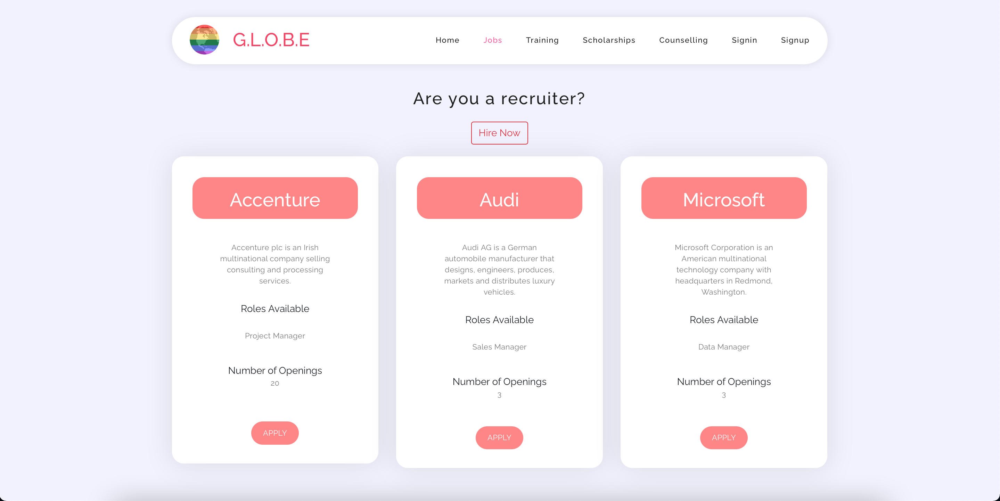

# G.L.O.B.E
##### Gay Lesbian or Bisexual Employees 

## Table of Contents
1. [General Info](#general-info)
2. [Live Demo](#live-demo)
3. [Technologies](#technologies)
4. [Installation](#installation)
5. [Features](#features)
### General Info
***
**G.L.O.B.E** is an exculsive Job platform the LGBTQ+ community. The problem G.L.O.B.E- Gay Lesbian or Bisexual Employees solves:
* No hiring platform for LGBTQ+
There is no exclusive hiring platform for our friends from the LGBTQ+ community, we know it's hard paving a career path, and for our friends from the PRIDE community, it's even tougher.

* Diversity Hiring
Workplace diversity is important for the overall growth and contributes highly to an organisation's success. But companies and firms often find it difficult to find and hire people from the PRIDE community.

* Social Inclusion
The society often ignores the PRIDE community and treats them as different. It’s high time we address such issues and bring about a change in society.

* Helping the young, making the roots strong
Young people of this community often fear society & struggle to find career opportunities. Thus, we focus on jobs, internships and scholarships for them.

## Live Demo 
***
Project Link: https://vibrant-shannon-e7fb61.netlify.app/

Demo Video: https://youtu.be/QR-0Ujgpr20

### Screenshots
* Home Page


* Login Page

* Jobs page

* Training page


## Technologies
***
A list of technologies used within the project:
* HTML 
* CSS
* Bootstrap
* MongoDB
* Node.js

## Installation
***
A little intro about the installation. 
```
$ git clone https://github.com/Riyadevvarshney11/G.L.O.B.E---HackNITR-Project-.git
$ npm install
$ nodemon
```

<div align= "center" > Made with ❤️ and ☕️ </div>
